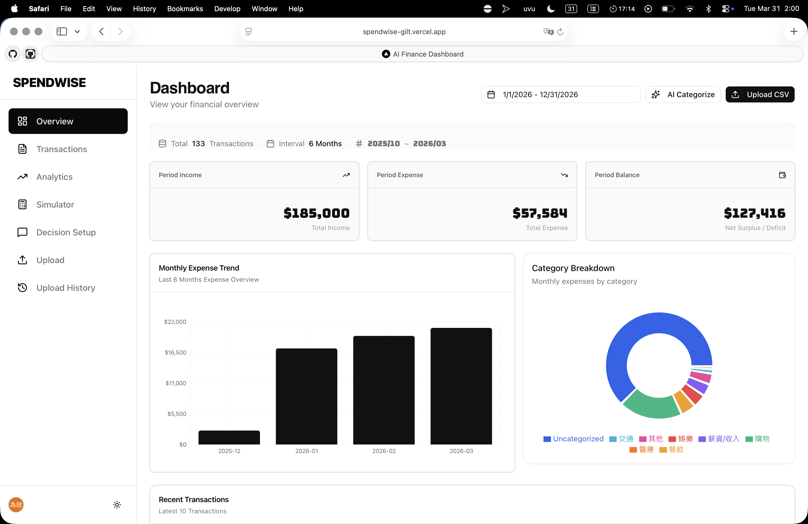
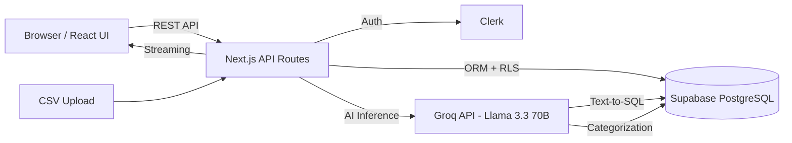

# SpendWise

[](https://github.com/LarryinMexico/spendwise/actions/workflows/ci.yml)
[](https://opensource.org/licenses/MIT)

> AI-powered personal finance dashboard with natural language queries, smart categorization, and spending simulation.

[English](./README.md) | [繁體中文](./README.zh-TW.md)

**Demo: [https://spendwise-gilt.vercel.app/dashboard](https://spendwise-gilt.vercel.app/dashboard)**



## Architecture



## Features

### 1. CSV Upload & Parsing
- **Intelligent Field Mapping**: Automatically detects and maps common field names such as "Transaction Date", "Description", "Expense", and "Income". Compatible with CSV formats from most major banks (e.g., E.SUN, Cathay, CTBC).
- Drag-and-drop upload interface.
- Batch import supported for multiple transactions.
- Upload history management to view and delete historical batches.

### 2. AI Auto-Categorization
- Powered by **Groq API (Llama 3.3 70B)** for smart transaction classification.
- 10+ Categories: Dining, Transport, Shopping, Entertainment, Medical, Education, Housing, Salary/Income, Transfer, Others.
- Batch processing (up to 20 transactions per batch) to optimize API usage and avoid rate limits.

### 3. Natural Language Querying (Text-to-SQL)
- "How much did I spend on dining this month?"
- AI converts natural language into secure SQL queries.
- Three-layer security: Prompt constraints, table whitelisting, and parameterized queries.

### 4. Spending Trend Analysis
- Monthly income vs. expense bar charts.
- Category distribution pie charts.
- Behavioral Insights:
  - Weekly spending patterns analysis.
  - Anomaly detection (2 standard deviations).
  - Trend forecasting (Rising/Falling/Stable).

### 5. Consumption Simulator
- Select expense categories and adjust spending ratios (-80% to +50%).
- Real-time projections for 1/3/6/9/12 months.
- Visual line chart comparison: Current vs. Adjusted trends.
- AI-generated financial advice based on simulations.

### 6. Spending Decision Assistant
- Real-time input in the sidebar: "Should I buy the iPhone 16?"
- AI analysis based on live financial data:
  - Monthly income, expenses, and current balance.
  - Historical averages for the specific category.
- Provides Buy/Postpone/Don't Buy recommendations.

## Tech Stack

| Layer | Technology |
|-------|-----------|
| **Framework** | Next.js 16 (App Router) |
| **Language** | TypeScript |
| **Styling** | Tailwind CSS |
| **UI Components** | Shadcn UI |
| **Charts** | Recharts |
| **Authentication** | Clerk |
| **Database** | Supabase (PostgreSQL + RLS) |
| **ORM** | Drizzle |
| **AI Engine** | Groq API (Llama 3.3 70B) |
| **Testing** | Vitest (Unit) + Playwright (E2E) |
| **CI/CD** | GitHub Actions |
| **Deployment** | Vercel |

## Local Development

### Prerequisites
- Node.js 18+
- npm / yarn / pnpm / bun
- Supabase account
- Clerk account
- Groq API Key

### 1. Clone & Install

```bash
git clone https://github.com/LarryinMexico/spendwise.git
cd spendwise
npm install
```

### 2. Environment Variables

```bash
cp .env.example .env.local
```

Edit `.env.local`:

| Variable | Description | Source |
|------|------|----------|
| `NEXT_PUBLIC_CLERK_PUBLISHABLE_KEY` | Clerk Publishable Key | [Clerk Dashboard](https://clerk.com) - API Keys |
| `CLERK_SECRET_KEY` | Clerk Secret Key | [Clerk Dashboard](https://clerk.com) - API Keys |
| `DATABASE_URL` | Supabase PostgreSQL Connection String | [Supabase Dashboard](https://supabase.com) - Settings - Database |
| `GROQ_API_KEY` | Groq API Key | [Groq Console](https://console.groq.com) - API Keys |
| `NEXT_PUBLIC_APP_URL` | App URL (Local: `http://localhost:3000`) | - |

### 3. Supabase Setup

1. Create a new project in Supabase.
2. Get the `DATABASE_URL`.
3. Run migrations:
   ```bash
   npm run db:migrate
   ```
4. Alternatively, manually execute SQL files in the `drizzle/` directory via Supabase SQL Editor:
   - `0001_enable_rls.sql` - Enable RLS
   - `0002_create_uploads_table.sql` - Create uploads table

### 4. Start Development Server

```bash
npm run dev
```

Open http://localhost:3000

## Testing

```bash
# Run unit tests
npm test

# Run unit tests in watch mode
npm run test:watch

# Run with coverage report
npm run test:coverage

# Run E2E tests
npm run test:e2e
```

## Quick Start & Testing Guide

To help you experience SpendWise's AI analysis and visualization features immediately, the project includes 6 months of built-in financial test data.

**How to use test data:**

1. Start and log in to the local server, then navigate to the **Upload** page.
2. Open the `public/` folder in the project root to find pre-made CSV test files:
   - `sample-transactions.csv` (General examples)
   - `sample-transactions-2025-10.csv` to `sample-transactions-2026-02.csv` (Time-series simulation for trend charts)
3. Drag and drop these `.csv` files into the upload area.
4. Click the **AI Categorize** button to see the LLM categorize your spending in seconds.
5. Explore the **Dashboard**, **Analytics**, and **Simulator** pages for data visualizations and AI insights!

## Docker Support

This project supports containerized deployment using Docker.

### 1. Build Image

```bash
docker build -t spendwise-app .
```

### 2. Run Container

```bash
docker run -p 3000:3000 \
  --env-file .env.local \
  spendwise-app
```

*Note: Ensure your `.env.local` is correctly configured before running.*

## Deployment

### 1. Push to GitHub

```bash
git add .
git commit -m "Add documentation"
git push origin main
```

### 2. Deploy on Vercel

1. Go to [Vercel Dashboard](https://vercel.com).
2. "Add New Project" and select your repository.
3. Configure environment variables (same as `.env.local`).
4. Click "Deploy".

## Database Schema

### `transactions` table

| Column | Type | Description |
|------|------|------|
| `id` | UUID | Primary Key |
| `clerk_user_id` | TEXT | Clerk User ID (for RLS) |
| `upload_id` | UUID | Batch Upload ID |
| `original_date` | DATE | Transaction Date |
| `original_description` | TEXT | Description |
| `original_amount` | NUMERIC | Original Amount |
| `normalized_amount` | NUMERIC | Absolute Value of Amount |
| `transaction_type` | TEXT | `income` / `expense` / `transfer` |
| `ai_category` | TEXT | AI Classified Category |
| `ai_category_confidence` | TEXT | Confidence Score |
| `status` | TEXT | `pending` / `categorized` |

### `uploads` table

| Column | Type | Description |
|------|------|------|
| `id` | UUID | Primary Key |
| `file_name` | TEXT | Original Filename |
| `transaction_count` | INTEGER | Number of Transactions |
| `created_at` | TIMESTAMP | Upload Time |

## Security

### Authentication
- All API routes are protected by Clerk. Unauthenticated requests return 401.

### Data Isolation
- Supabase Row Level Security (RLS) is enabled.
- Every query is automatically filtered by `clerk_user_id`.
- Database sessions use `SET LOCAL ROLE authenticated` to activate RLS policies.

### Text-to-SQL Safety
- Read-only: Only SELECT queries are allowed.
- Whitelisting: Only the `transactions` table can be queried.
- Pattern Matching: Blocks dangerous keywords (UNION, DROP, etc.).
- Auto-Injected Filters: Automatically adds user-specific data isolation to SQL.

### Rate Limiting
- In-memory sliding window rate limiter on all AI endpoints.
- Per-endpoint configurable limits (e.g., 20 req/min for queries, 5 req/min for uploads).

## License

MIT
